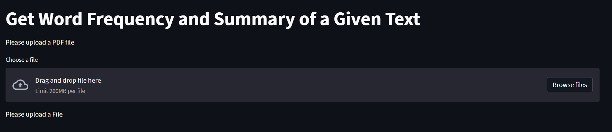
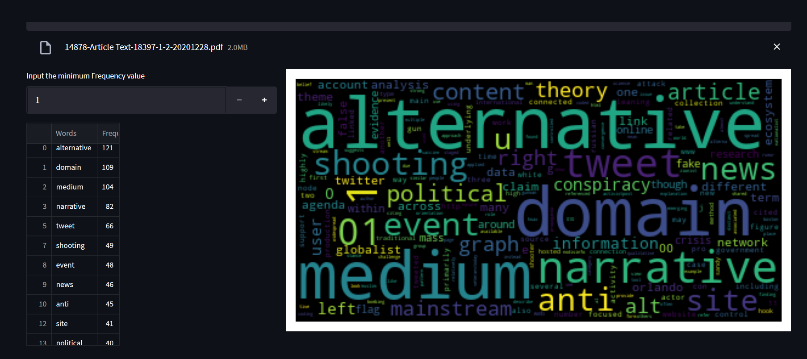
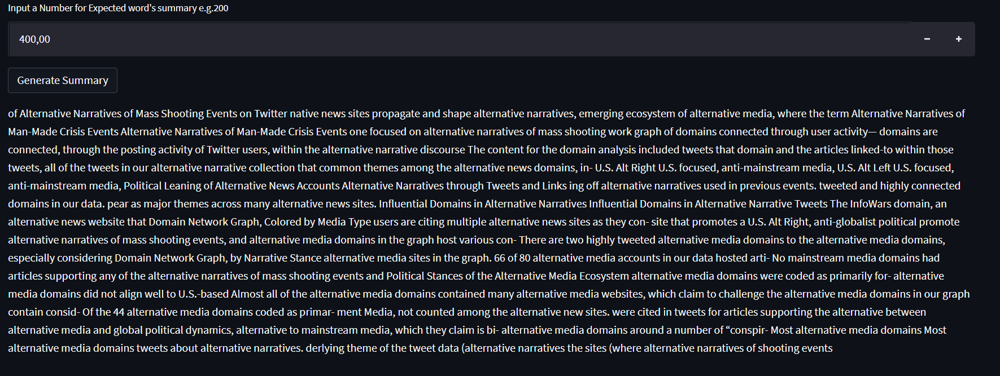

# text_summarizationa_keyword

## About

 The idea of this project is summarize a given text, visulize a beautiful word cloud and also present the frequency of a particular word occured in the document. 
 I made this app limited for only pdf file.

 
 ## Library Used
 - Python Pandas
 - PyPDF2
 - WordCloud
 - Mathplotlib
 - NLTK (To remove stop words, WordNetLemmatizer)
 - Gensim 3.8 (for summarization) *just to note new version don't use text summarization.
 - Stremlit

## Overview of The Project
After run the app we will find an interface like below
  

Here just require to upload a pdf then the app will generate a word frequence table and a wordcloud like below image.

  

Finally we have to give a number to generate summary from the uploaded pdf. Again below image will represent a sample view.
  

Finally Thank you for visiting.

 
 
 
